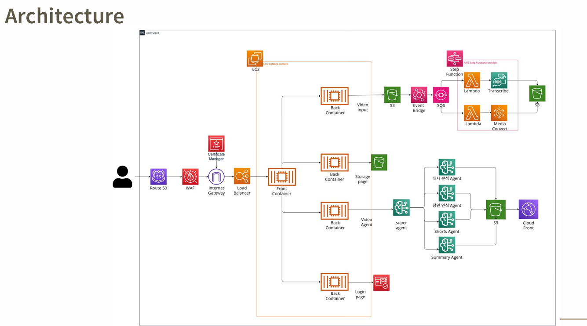

# ClipHaus

AI 기반 비디오 편집 및 관리 플랫폼

## 개요

ClipHaus는 AWS 서비스와 AI 기술을 활용하여 비디오를 자동으로 편집하고 관리할 수 있는 웹 애플리케이션입니다. 사용자는 비디오를 업로드하고 AI를 통해 원하는 구간을 추출하거나 편집할 수 있습니다.

## 아키텍처



## Bedrock Flow


## 주요 기능

- **비디오 업로드**: S3를 통한 안전한 비디오 파일 저장
- **AI 비디오 편집**: Amazon Bedrock을 활용한 지능형 비디오 편집
- **비디오 관리**: 업로드된 비디오 목록 조회 및 삭제
- **사용자 인증**: AWS Cognito를 통한 안전한 사용자 관리
- **실시간 처리**: Step Functions를 통한 비디오 처리 워크플로우

## 기술 스택

### Frontend
- **Next.js 15**: React 기반 프론트엔드 프레임워크
- **TypeScript**: 타입 안전성을 위한 정적 타입 언어
- **Tailwind CSS**: 유틸리티 기반 CSS 프레임워크
- **Radix UI**: 접근성을 고려한 UI 컴포넌트 라이브러리

### Backend API Services
- **Flask**: Python 웹 프레임워크
- **Flask-CORS**: 크로스 오리진 리소스 공유 설정
- **Boto3**: AWS SDK for Python

### AWS Services
- **S3**: 비디오 파일 저장소
- **Bedrock**: AI 모델 서비스
- **Step Functions**: 워크플로우 오케스트레이션
- **Lambda**: 서버리스 컴퓨팅
- **Transcribe**: 음성-텍스트 변환
- **MediaConvert**: 비디오 변환 서비스
- **Cognito**: 사용자 인증 및 관리
- **EventBridge**: 이벤트 기반 아키텍처

### Infrastructure
- **Docker**: 컨테이너화
- **SAM (Serverless Application Model)**: AWS 서버리스 애플리케이션 배포
- **CloudFormation**: Infrastructure as Code

## 프로젝트 구조

```
ClipHaus/
├── api/                    # Backend API 서비스
│   ├── bucket_list/        # S3 버킷 관리 API
│   ├── s3_upload/          # 파일 업로드 API
│   ├── video_ai/           # AI 비디오 편집 API
│   └── sign_upin/          # 사용자 인증 API
├── front_final/            # Next.js 프론트엔드
│   ├── app/                # App Router 페이지
│   ├── components/         # 재사용 가능한 컴포넌트
│   ├── hooks/              # 커스텀 React 훅
│   ├── lib/                # 유틸리티 함수
│   ├── styles/             # 스타일 파일
│   └── types/              # TypeScript 타입 정의
├── sam/                    # AWS SAM 템플릿
│   ├── modules/            # SAM 모듈
│   │   ├── eventbridge/    # EventBridge 설정
│   │   ├── lambdas/        # Lambda 함수들
│   │   └── stepfunctions/  # Step Functions 정의
│   └── template.yaml       # 메인 SAM 템플릿
├── images/                 # 문서용 이미지
├── docker-compose.yml      # Docker 컨테이너 오케스트레이션
└── README.md
```

## 설치 및 실행

### 사전 요구사항
- Docker 및 Docker Compose
- AWS CLI 설정
- Node.js 18+ (로컬 개발 시)
- Python 3.9+ (로컬 개발 시)

### Docker를 사용한 실행

1. 저장소 클론
```bash
git clone https://github.com/KiM-Taeseon/ClipHaus.git
cd ClipHaus
```

2. 환경 변수 설정
각 API 서비스의 환경 변수를 docker-compose.yml에서 확인하고 필요에 따라 수정

3. 애플리케이션 실행
```bash
docker-compose up -d
```

4. 서비스 접속
- 접속 URL: https://www.videofinding.com

5. 회원가입 및 로그인
AWS 서비스 기반이므로 크레딧 기반이 아닌 사용자가 원하는 만큼 사용가능!

## 개발

### 로컬 개발 환경 설정

1. Frontend 개발
```bash
cd front_final
npm install
npm run dev
```

2. Backend API 개발
```bash
cd api/[service_name]
pip install -r requirements.txt
python app.py
```

## 보안 고려사항

- AWS Cognito를 통한 사용자 인증
- CORS 설정으로 허용된 도메인만 접근 가능
- AWS IAM 역할 기반 권한 관리
- 환경 변수를 통한 민감한 정보 관리
